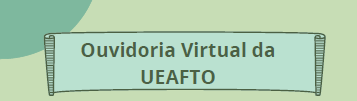

<h1 align="center">
    
</h1>

<h4 align="center"> 
	👾 Ouvidoria Virtual da UEAFTO - Turma de Fisioterapia 2022 da UEPA👾
</h4>

## 🤖 Onde encontrar ?

O Projeto está hospedado pelo GitHub Pages e você pode acessar pelo <a href="https://brunnasousa.github.io/ouvidoria-virtual-ueafto/" target="_blank" rel="external">link.</a> 

- link principal: https://brunnasousa.github.io/ouvidoria-virtual-ueafto/

- link alternativo: https://brunnasousa.github.io/ouvidoria-virtual-ueafto/

## 💻 Sobre o projeto

- Projeto feito com base na cartilha da turma de 2022 de fisioterapia da uepa, sobre o tema: Ouvidoria Virtual da UEAFTO.
- A Ouvidoria Virtual da UEAFTO tem como objetivo de oferecer a chance de poder expressar suas opiniões e dúvidas sobre os atendimentos e a dinâmica da Unidade de Ensino e Assistência de Fisioterapia e Terapia Ocupacional, na Universidade do Estado do Pará - UEPA.
- O projeto está responsivo para dispositivo celular e desktop.

## 🛠 Ferramentas

As seguintes ferramentas foram usadas na construção do projeto:

-   [HTML](https://developer.mozilla.org/pt-BR/docs/Web/HTML)
-   [CSS](https://developer.mozilla.org/pt-BR/docs/Web/CSS) - Mobile First

## 🎨 Paleta de cor

- #FFFFFF; -> branco
- #000000 -> preto
- #87c6ab -> verde
- #64937c -> -verde-escuro
- #c8e0bc -> verde-claro
- #45605a -> verde-texto
- #c2debd -> cor-de-fundo

## 📝 Autor - Contact

<table>
  <tr>
    <td align="center">
      
 

      <a href="https://www.linkedin.com/in/brunna-sousa">
         
         
          <b>Feito com ❤️ por Brunna Sousa 😄</b> 
          <b>Entre em contato.  </b>
        
      </a>
    </td>
  </tr>
</table>

* Link do meu portfolio com todos meus [projetos](https://brunnasousa.github.io/portfolio_brunnasousa/) 

## 👀 Observações Importantes

- O site tem intuito somente acadêmico e não tem como objetivo causar danos à imagem das pessoas descritas no website.

## 📢 Proximas Etapas
- responsividade para tablet.